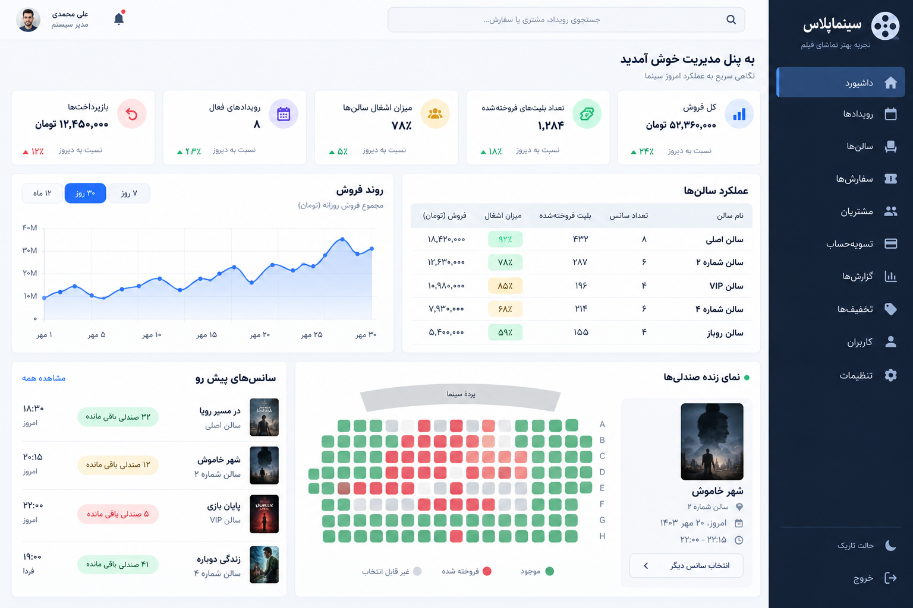

# امکانات سینماپلاس

## مشتری

- مرور فیلم‌ها و تئاترها با دسته‌بندی منعطف
- جست‌وجو و فیلتر شهر، تاریخ، ژانر و نوع رویداد
- مشاهده جزئیات رویداد و سانس‌ها
- انتخاب صندلی معمولی و VIP
- جلوگیری از فروش هم‌زمان صندلی با تراکنش دیتابیس
- ثبت سفارش و صدور بلیت یکتا
- صفحه بلیت و کد قابل اعتبارسنجی

## مدیریت شرکت

- داشبورد فروش و ظرفیت
- مدیریت سازمان، سالن، صندلی، رویداد و سانس
- نقش‌های قابل توسعه با Spatie Permission
- گزارش سفارش‌ها و فروش
- آماده اتصال به پنل برگزارکننده و اپراتور گیشه

## زیرساخت

- Laravel 13
- MySQL/PostgreSQL یا SQLite برای توسعه
- Redis و Queue آماده توسعه
- Kavenegar از طریق `KAVENEGAR_API_KEY`
- Media Library برای پوستر و فایل‌ها
- تاریخ شمسی با Morilog Jalali/Byekan-compatible API
- Docker Compose

## تصاویر طراحی

