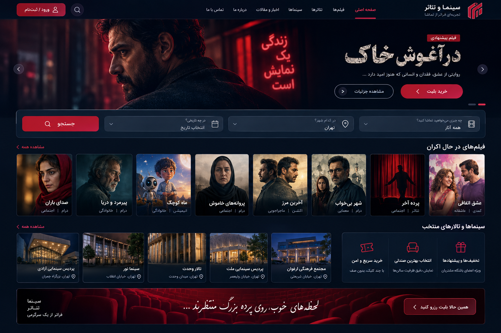
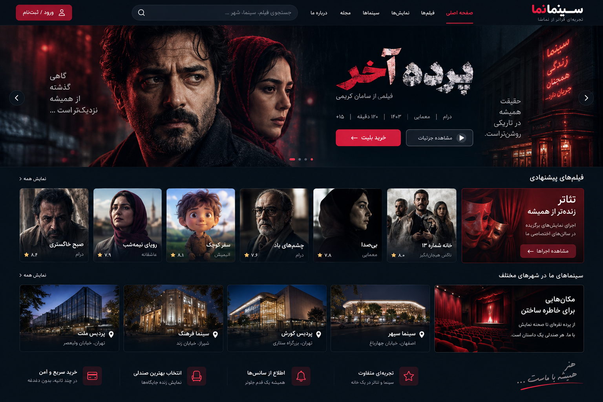
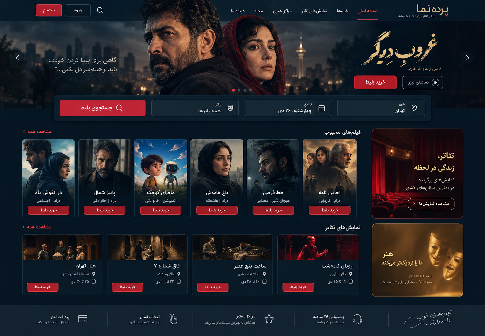
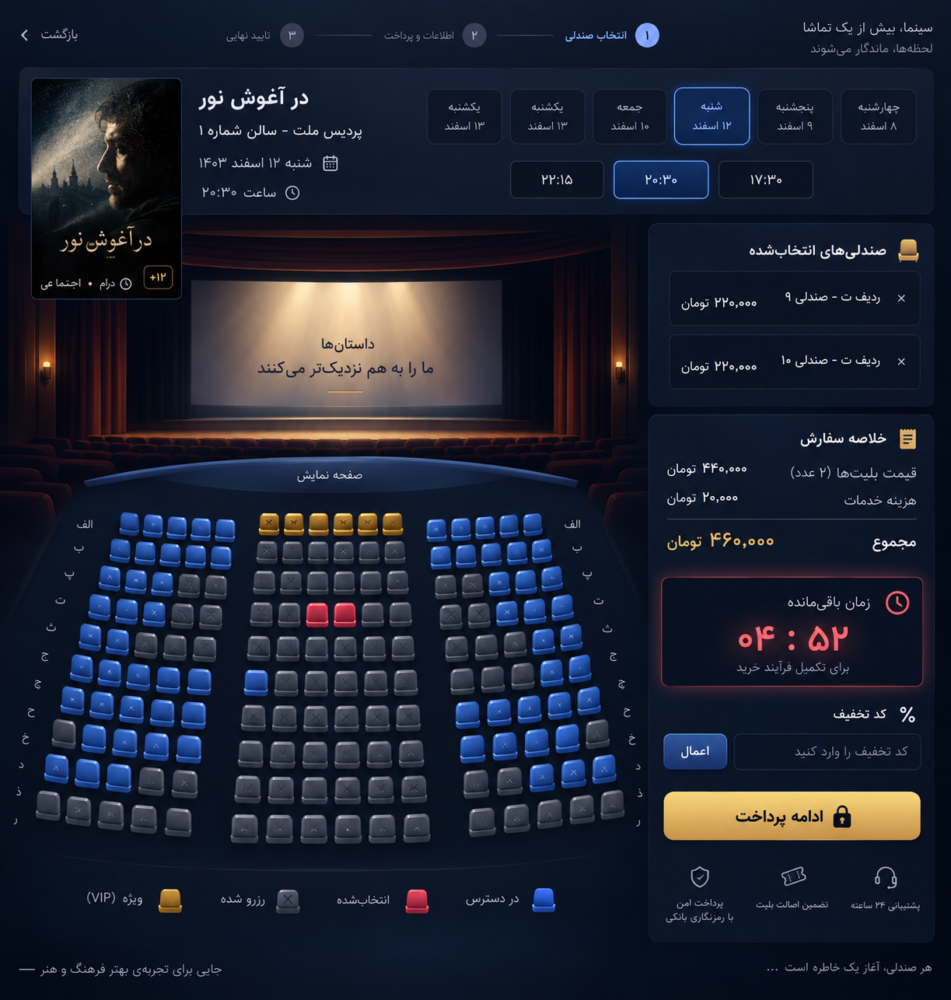
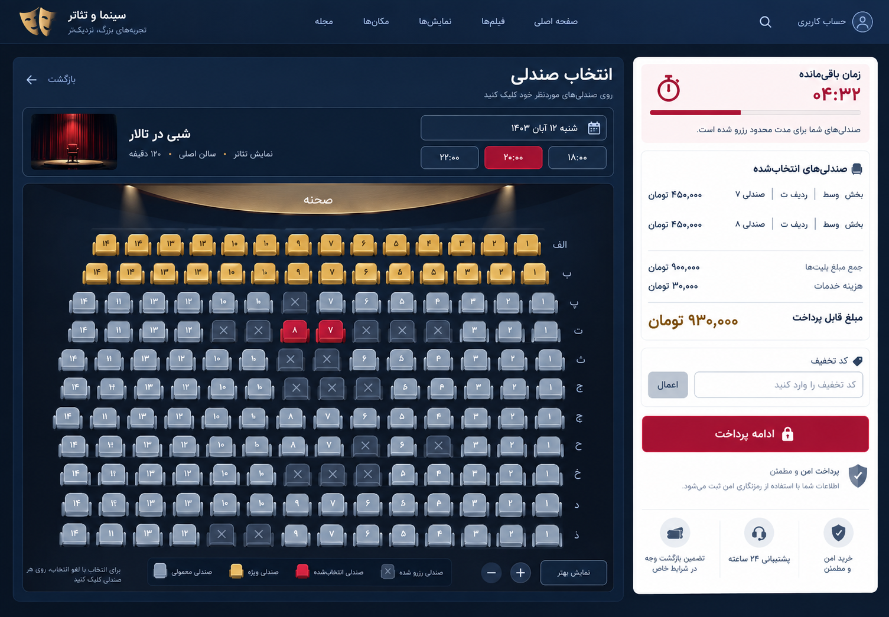
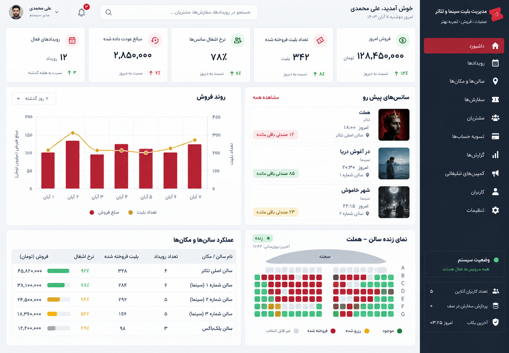

# مستند تصویری سینماپلاس

این سند تصاویر مرجع طراحی و مسیرهای متناظر سامانه را با رزولوشن اصلی نگهداری می‌کند. فایل‌ها فشرده یا thumbnail نشده‌اند و برای بررسی UI، ارائه به کارفرما و مقایسهٔ بصری قابل استفاده‌اند.

## صفحات عمومی

### صفحهٔ اصلی سینماپلاس

### نسخهٔ جایگزین صفحهٔ اصلی

### صفحهٔ اصلی پرده

## انتخاب صندلی و پرداخت

### انتخاب صندلی با تم تیره

### انتخاب صندلی با تم روشن

## پنل مدیریت

### داشبورد مدیریت تیره

### داشبورد مدیریت روشن

## مسیرهای پیاده‌سازی‌شده

| بخش | مسیر محلی |
|---|---|
| صفحه اصلی | `/` |
| جست‌وجوی رویدادها | `/search` |
| ورود مشتری با OTP | `/customer/login` |
| ورود مدیریت | `/login` |
| داشبورد مدیریت | `/admin` |
| انتخاب صندلی | `/booking/{show}/seats` |
| سفارش‌های مشتری | `/account/orders` |
| بلیت‌های مشتری | `/account/tickets` |

## نکتهٔ کیفیت

تصاویر این پوشه از فایل‌های اصلی دریافت‌شده نگهداری شده‌اند. برای استفاده در ارائه، ابتدا فایل PNG اصلی را باز کنید و از نسخهٔ نمایش‌داده‌شده در Markdown به‌عنوان preview استفاده کنید.
